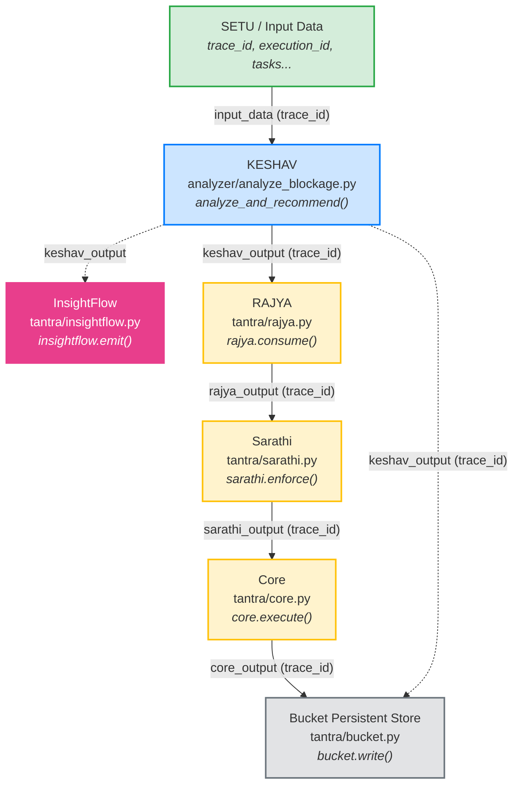

# TANTRA Wiring Report
**Phase 3 — TANTRA Wiring Validation**

**Objective**: Verify the actual runtime path for the `SETU/Input → KESHAV → RAJYA → Sarathi → Core → Bucket` pipeline, including InsightFlow observability.

---

## 1. Ownership & Integration Roadmap

### Service Ownership
To coordinate across the engineering team, ownership for each block in the TANTRA pipeline is defined as follows:

*   **SETU / Input Data**: External Signal Platform / Upstream Team.
*   **KESHAV (Dependency Intelligence)**: Rajya & Keshav (User).
*   **RAJYA (Decision Layer)**: Rajya & Keshav (User).
*   **Sarathi (Enforcement Layer)**: Partner Team Member.
*   **Core (Execution Layer)**: Partner Team Member.
*   **Bucket (Truth Layer / Storage)**: Partner Team Member.
*   **InsightFlow (Observability)**: Partner Team Member.

### Integration Strategy
Because SETU is the real-time ingest platform, integrating it directly from the start poses a risk of debugging in flight. The following integration strategy is enforced:
1.  **Phase A**: Integrate the core logic under Rajya/Keshav's ownership (`KESHAV` and `RAJYA`) with the downstream components (`Sarathi` → `Core` → `Bucket` and `InsightFlow`) using test wiring scripts.
2.  **Phase B**: Perform end-to-end dry runs, ensuring fail-closed assertions and trace IDs propagate perfectly across all team members' components.
3.  **Phase C**: Once the entire internal TANTRA pipeline is fully ready, verified, and hardened, connect the real-time `SETU` platform as the final entry point.

---

## 2. TANTRA Pipeline Flow Diagram



---

## 3. Detailed Component Contracts & Payload Schemas

### 3.1 SETU / Input → KESHAV
*   **File Location**: [analyze_blockage.py](file:///c:/rajaryan/KESHAV-4/analyzer/analyze_blockage.py)
*   **Execution Path**: `analyze_and_recommend(input_data)`
*   **Trace Continuity Proof**: The `trace_id` is extracted from the input dictionary and passed completely unchanged to the output structuring layer. It is never modified or regenerated.

#### Work of this Phase
KESHAV parses the incoming dependency and constraint graphs, detects blocked tasks, traces the root cause to its primary source (the root task violating constraints), calculates propagation impact scores, and generates an optimized resolution signal.

#### Purpose of this Phase
To serve as the **Dependency Intelligence Layer**. It acts as the brain of the pipeline, converting raw execution/task metrics into structured recommendations for resolving blockages.

#### Input Contract (Request)
*   `trace_id` (string, required): Unique identifier for the trace.
*   `execution_id` (string, required): Identifier for this execution.
*   `tasks` (array of objects, optional): Each object contains `task_id` (string) and `depends_on` (array of strings).
*   `constraint_results` (array of objects, optional): Each object contains `task_id` (string), `is_valid` (boolean), and `unsatisfied_dependencies` (array of strings).
*   `propagation_results` (array of objects, optional): Each object contains `task_id` (string), `affected_tasks` (array of strings), and `impact_score` (number).

```json
{
  "trace_id": "setu-trace-12345",
  "execution_id": "exec-setu-9876",
  "tasks": [
    { "task_id": "T1", "depends_on": [] },
    { "task_id": "T2", "depends_on": ["T1"] }
  ],
  "constraint_results": [
    { "task_id": "T1", "is_valid": false, "unsatisfied_dependencies": [] },
    { "task_id": "T2", "is_valid": false, "unsatisfied_dependencies": ["T1"] }
  ],
  "propagation_results": [
    { "task_id": "T1", "affected_tasks": ["T2"], "impact_score": 10 }
  ]
}
```

#### Output Contract (Passed to next phase: KESHAV → RAJYA)
*   `trace_id` (string): Identical to the input `trace_id`.
*   `execution_id` (string): Identical to the input `execution_id`.
*   `root_cause` (string or null): The determined root cause task ID.
*   `resolution_signal` (string or null): Recommendation action (e.g., `UNBLOCK_DEPENDENCY:T1`).
*   `impact_score` (number): Overall dependency impact score.
*   `severity` (string): Low, Medium, or High.
*   `timestamp` (string): UTC timestamp.

```json
{
  "trace_id": "setu-trace-12345",
  "execution_id": "exec-setu-9876",
  "root_cause": "T1",
  "resolution_signal": "UNBLOCK_DEPENDENCY:T1",
  "impact_score": 10,
  "severity": "HIGH",
  "timestamp": "2026-07-23T18:47:17Z"
}
```

---

### 3.2 KESHAV → RAJYA
*   **File Location**: [rajya.py](file:///c:/rajaryan/KESHAV-4/tantra/rajya.py)
*   **Execution Path**: `rajya.consume(keshav_output, trace_id)`
*   **Trace Continuity Proof**: RAJYA enforces continuity via `if keshav_output["trace_id"] != expected_trace_id: raise ValueError(...)`.

#### Work of this Phase
RAJYA consumes KESHAV's structured analyzer results directly, performing a strict validation check on the `trace_id` and checking if KESHAV recorded a failure. It performs zero schema transformation.

#### Purpose of this Phase
To serve as the **Decision Layer**. It ensures that the analysis results are verified and trace integrity is fully intact before letting downstream execution components take action on the signal.

#### Input Contract
*   The exact identical output dictionary returned by KESHAV's `analyze_and_recommend`.

```json
{
  "trace_id": "setu-trace-12345",
  "execution_id": "exec-setu-9876",
  "root_cause": "T1",
  "resolution_signal": "UNBLOCK_DEPENDENCY:T1",
  "impact_score": 10,
  "severity": "HIGH",
  "timestamp": "2026-07-23T18:47:17Z"
}
```

#### Output Contract (Passed to next phase: RAJYA → Sarathi)
*   The exact identical dictionary (zero-transformation passthrough).

```json
{
  "trace_id": "setu-trace-12345",
  "execution_id": "exec-setu-9876",
  "root_cause": "T1",
  "resolution_signal": "UNBLOCK_DEPENDENCY:T1",
  "impact_score": 10,
  "severity": "HIGH",
  "timestamp": "2026-07-23T18:47:17Z"
}
```

---

### 3.3 RAJYA → Sarathi
*   **File Location**: [sarathi.py](file:///c:/rajaryan/KESHAV-4/tantra/sarathi.py)
*   **Execution Path**: `sarathi.enforce(rajya_output)`
*   **Trace Continuity Proof**: Extracts `trace_id` from the payload, verifies its presence, and maps it directly into the returned enforcement dictionary.

#### Work of this Phase
Sarathi reads the `resolution_signal` from the validated payload. It wraps this signal into an explicit operational action (e.g., prepending `"ENFORCE:"` prefix or outputting `"NO_ACTION"` if no resolution signal is present).

#### Purpose of this Phase
To serve as the **Enforcement Layer**. It maps raw analytical recommendations to policy-controlled, enforceable system tasks, translating an abstract recommendation into a concrete instruction.

#### Input Contract
*   The `rajya_output` dictionary received from RAJYA.

```json
{
  "trace_id": "setu-trace-12345",
  "execution_id": "exec-setu-9876",
  "root_cause": "T1",
  "resolution_signal": "UNBLOCK_DEPENDENCY:T1",
  "impact_score": 10,
  "severity": "HIGH",
  "timestamp": "2026-07-23T18:47:17Z"
}
```

#### Output Contract (Passed to next phase: Sarathi → Core)
*   `trace_id` (string): Identical trace ID.
*   `enforced` (boolean): Flag confirming enforcement layer has executed.
*   `resolution_signal` (string or null): Enforced signal.
*   `action` (string): Enforced action string format (e.g., `ENFORCE:UNBLOCK_DEPENDENCY:T1`).

```json
{
  "trace_id": "setu-trace-12345",
  "enforced": true,
  "resolution_signal": "UNBLOCK_DEPENDENCY:T1",
  "action": "ENFORCE:UNBLOCK_DEPENDENCY:T1"
}
```

---

### 3.4 Sarathi → Core
*   **File Location**: [core.py](file:///c:/rajaryan/KESHAV-4/tantra/core.py)
*   **Execution Path**: `core.execute(sarathi_output)`
*   **Trace Continuity Proof**: Verifies `trace_id` in `sarathi_output` is present, fail-closed otherwise, and preserves it.

#### Work of this Phase
Core receives the enforcement instruction and carries out the physical operations (e.g., executing scripts, triggering system state changes, or orchestrating downstream recovery microservices) required to apply the fix, setting the `executed` status flag.

#### Purpose of this Phase
To serve as the **Execution Layer**. This component actually triggers the real-world operational execution of the policy and registers its completion.

#### Input Contract
*   The `sarathi_output` dictionary.

```json
{
  "trace_id": "setu-trace-12345",
  "enforced": true,
  "resolution_signal": "UNBLOCK_DEPENDENCY:T1",
  "action": "ENFORCE:UNBLOCK_DEPENDENCY:T1"
}
```

#### Output Contract (Passed to next phase: Core → Bucket)
*   `trace_id` (string): Identical trace ID.
*   `executed` (boolean): Flag confirming action execution.
*   `action` (string): Action string carried forward.

```json
{
  "trace_id": "setu-trace-12345",
  "executed": true,
  "action": "ENFORCE:UNBLOCK_DEPENDENCY:T1"
}
```

---

### 3.5 Core → Bucket
*   **File Location**: [bucket.py](file:///c:/rajaryan/KESHAV-4/tantra/bucket.py)
*   **Execution Path**: `bucket.write(core_output, keshav_output)`
*   **Trace Continuity Proof**: Extracts `trace_id` from `core_output` and checks presence. Uses `trace_id` as the primary key for thread-safe key-value persistence.

#### Work of this Phase
Bucket receives the execution details from the Core layer along with the original analytical intelligence from the KESHAV/RAJYA layer. It stores this unified record into a thread-safe, bounded, in-memory storage dictionary keyed by the `trace_id`.

#### Purpose of this Phase
To serve as the **Truth Layer**. It provides persistent storage of the pipeline's execution history, enabling auditability, deterministic replay capability, and verification of truth.

#### Input Contract
*   `core_output` (dictionary): Execution results.
*   `keshav_output` (dictionary): Analyzer results.

##### core_output
```json
{
  "trace_id": "setu-trace-12345",
  "executed": true,
  "action": "ENFORCE:UNBLOCK_DEPENDENCY:T1"
}
```
##### keshav_output
```json
{
  "trace_id": "setu-trace-12345",
  "execution_id": "exec-setu-9876",
  "root_cause": "T1",
  "resolution_signal": "UNBLOCK_DEPENDENCY:T1",
  "impact_score": 10,
  "severity": "HIGH",
  "timestamp": "2026-07-23T18:47:17Z"
}
```

#### Storage Schema (Resulting saved state inside Bucket)
*   Key: `setu-trace-12345`
*   Value:
```json
{
  "trace_id": "setu-trace-12345",
  "keshav_output": {
    "trace_id": "setu-trace-12345",
    "execution_id": "exec-setu-9876",
    "root_cause": "T1",
    "resolution_signal": "UNBLOCK_DEPENDENCY:T1",
    "impact_score": 10,
    "severity": "HIGH",
    "timestamp": "2026-07-23T18:47:17Z"
  },
  "core_output": {
    "trace_id": "setu-trace-12345",
    "executed": true,
    "action": "ENFORCE:UNBLOCK_DEPENDENCY:T1"
  }
}
```

---

### 3.6 KESHAV → InsightFlow
*   **File Location**: [insightflow.py](file:///c:/rajaryan/KESHAV-4/tantra/insightflow.py)
*   **Execution Path**: `insightflow.emit(keshav_output)`
*   **Trace Continuity Proof**: Read-only extraction of `trace_id`. Does not block or mutate any downstream flow.

#### Work of this Phase
InsightFlow intercepts the KESHAV output in a strictly read-only fashion. If KESHAV reports a failure, it creates a `FAILURE` event. Otherwise, it compiles a structured `EXECUTION` event with key performance indicators (KPIs) and logs it.

#### Purpose of this Phase
To serve as the **Observability Layer**. It enables tracking telemetry, performance logging, dashboard visualization, and alerts without mutating or affecting the main execution path.

#### Input Contract
*   The `keshav_output` dictionary.

```json
{
  "trace_id": "setu-trace-12345",
  "execution_id": "exec-setu-9876",
  "root_cause": "T1",
  "resolution_signal": "UNBLOCK_DEPENDENCY:T1",
  "impact_score": 10,
  "severity": "HIGH",
  "timestamp": "2026-07-23T18:47:17Z"
}
```

#### Output (Logged Observability Event format)
Depending on status of `keshav_output`:

##### Normal Event:
```json
{
  "type": "EXECUTION",
  "trace_id": "setu-trace-12345",
  "root_cause": "T1",
  "impact_score": 10,
  "severity": "HIGH",
  "resolution_signal": "UNBLOCK_DEPENDENCY:T1"
}
```

##### Failure Event (If status == "FAIL"):
```json
{
  "type": "FAILURE",
  "trace_id": "setu-trace-12345",
  "reason": "INVALID_INPUT_CONTRACT"
}
```

---

## 4. Summary
The full execution path is orchestrated by `tantra/pipeline.py::run_tantra_pipeline()`.
**Actual Runtime Path Verified.** Trace continuity is unbroken, with all stages explicitly raising fail-closed `ValueError` if `trace_id` is missing or mismatched. There is no transformation of the core signal outside its intended boundaries.

