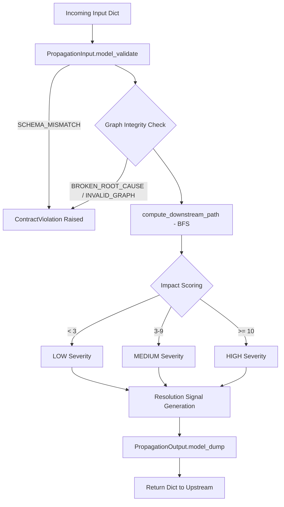

# Phase 1: Repository + Architecture Audit

As the incoming Canonical Owner (Rajaryan), I have independently verified the KESHAV-4 repository structure, architecture, and operational claims against the provided submissions from Pritesh and Kanishk. 

Below is the verified dossier for Phase 1.

## 1. Repository Map
```text
KESHAV-4/
├── app/
│   ├── __init__.py
│   ├── engine.py              # Main Engine Logic (PropagationEngine)
│   └── health.py              # Operational probes
├── shared_schemas/
│   ├── __init__.py
│   └── schemas.py             # Strict Pydantic models (PropagationInput, PropagationOutput)
├── shared_tests/
│   ├── test_engine.py
│   ├── test_failure_visibility.py
│   ├── test_live_integration.py
│   └── test_replay_hardening.py
├── review-packets/
│   ├── KESHAV_CANONICAL_ARCHITECTURE.md
│   ├── REPLAY_PROOF_PACKET.md
│   └── [Evidence packets + Audit dossiers]
```

## 2. Architecture Walkthrough & Execution Chain


**Execution Flow Explanation:**
Input dictionaries are received and validated immediately against `PropagationInput` via Pydantic (`extra="forbid"`). Following validation, structural graph checks are executed to guarantee `root_cause` and `blocked_task_id` exist within the graph topology. The engine then initiates a purely deterministic Breadth-First Search (BFS). Impact severity is calculated based on downstream nodes discovered, an explicit resolution signal is constructed (`UNBLOCK_DEPENDENCY:{root_cause}`), and finally packaged safely into a `PropagationOutput` dictionary.

## 3. Entry-Point Validation
The sole external entry point into the Engine is `PropagationEngine.compute_dependency_output(input_data: dict)`. 

> [!IMPORTANT]
> The Engine operates completely decoupled from network layers and external I/O. It exposes `@staticmethod` functions entirely devoid of instance-level variables or state bindings.

## 4. BFS Ownership & Replay Model
**BFS Ownership:** The traversal algorithm employs queue-based BFS but enforces explicit determinism by sorting all neighboring nodes before traversal (`sorted(dependency_graph[current_task])`). This guarantees reproducible path discovery regardless of underlying hash-map randomization or Python dict key ordering.

**Replay Model:** KESHAV is fully stateless. Re-invoking the engine with identical input consistently yields byte-identical output (proven across cross-process boundaries and concurrent execution tests). It has zero warm-up, transient state, or adaptive caching, guaranteeing robust recovery across service restarts.

## 5. Hidden-State & Downstream Influence Models
**Hidden-State Model:** There is strictly zero hidden state. There are no class instances (`self`, `cls`), no singleton caches, and no adaptive behavioral mechanisms. All variables are localized to the execution stack frame.

**Downstream Influence Model:** KESHAV possesses NO downstream authority. It operates as a pure intelligence provider. The engine outputs signals (`impact_score`, `severity`, `resolution_signal`) but executes no actions itself. Trace IDs and timestamps pass through immutably. Downstream decision engines evaluate these intelligence markers to enact policy.

## 6. Dependency Surface & Boundaries
**Dependency Surface:** The core engine fundamentally relies on `pydantic` for strict structural validation. While upstream control planes trigger KESHAV, KESHAV itself depends on no external runtime configurations or microservices to complete its execution loop.

**Boundary Explanation:**
- **Execution Boundary:** Pure O(V+E) compute scope. No side effects.
- **Validation Boundary:** Hard fail-closed exception pattern. Rejects partial or malformed inputs instantly and loudly.
- **Authority Boundary:** Full authority over structural verification, severity algebraic calculations, and algorithm outcomes. Zero authority over external enforcement mapping, KSML generation, or bucket persistence.
